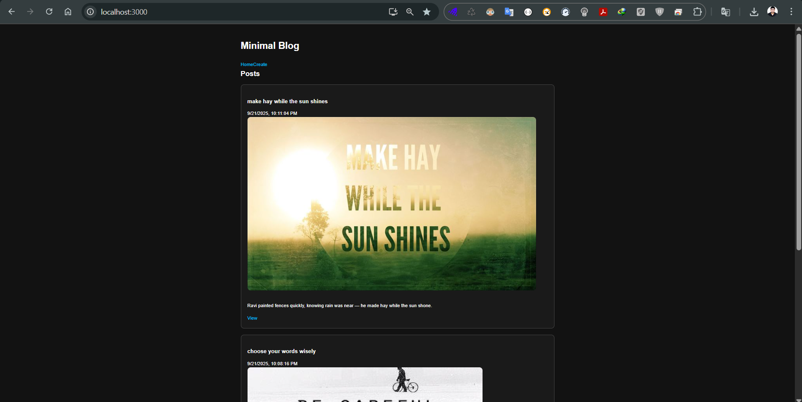

# Blog App (React + Node.js + Express + MongoDB)

A full-stack **Blog Application** where users can:

- Create a blog post with an image and text
- View posts with images
- Edit existing posts
- Delete posts

The app is built with a **React frontend** and a **Node.js + Express backend** using **Mongoose** for MongoDB. Image uploads are handled with **Multer** and stored locally.

---

## Features

- ✍️ **Create** posts with title, content, and optional image upload
- 👀 **View** all posts or single post details
- ✏️ **Edit** posts (update text and replace image)
- ❌ **Delete** posts with image cleanup
- 🎨 **Modern & Minimalist UI** with dark theme and accent colors

---

## Technologies Used

### Frontend

- [React](https://reactjs.org/) — UI framework
- [React Router](https://reactrouter.com/) — Client-side routing
- [Axios](https://axios-http.com/) — API requests
- **Custom CSS (Modern & Minimalist theme)** — Dark background, white text, blue/green accents

### Backend

- [Node.js](https://nodejs.org/) — JavaScript runtime
- [Express](https://expressjs.com/) — Web server framework
- [Mongoose](https://mongoosejs.com/) — MongoDB ODM
- [Multer](https://github.com/expressjs/multer) — File upload middleware
- [Cors](https://github.com/expressjs/cors) — Cross-origin requests
- [Dotenv](https://github.com/motdotla/dotenv) — Environment variables

### Database

- [MongoDB](https://www.mongodb.com/) (local or Atlas)

### Deployment

- [Heroku](https://www.heroku.com/) — Hosting backend and frontend
- MongoDB Atlas (recommended) for cloud database

---

## Project Structure

```
blog-app/
  backend/
    server.js
    routes/
      posts.js
    models/
      Post.js
    uploads/          <-- uploaded images
    package.json
    .env
  frontend/
    src/
      App.js
      index.js
      index.css
      api.js
      components/
        PostCard.jsx
      pages/
        Home.jsx
        CreatePost.jsx
        PostView.jsx
        EditPost.jsx
    package.json
  README.md
  Procfile (for Heroku)
```

---

## Setup Instructions

### 1. Clone the repository

```bash
git clone https://github.com/yourusername/blog-app.git
cd blog-app
```

### 2. Backend setup

```bash
cd backend
npm install
```

Create a `.env` file in the `backend/` folder:

```
PORT=5000
MONGO_URI=your_mongodb_connection_string
```

Run backend:

```bash
npm run dev
```

Backend runs at: `http://localhost:5000`

### 3. Frontend setup

```bash
cd ../frontend
npm install
npm start
```

Frontend runs at: `http://localhost:3000`

---

## API Endpoints

**Base URL:** `http://localhost:5000/api/posts`

| Method | Endpoint | Description           |
| ------ | -------- | --------------------- |
| GET    | `/`      | Get all posts         |
| GET    | `/:id`   | Get single post by ID |
| POST   | `/`      | Create new post       |
| PUT    | `/:id`   | Update post           |
| DELETE | `/:id`   | Delete post           |

Image field name for upload: **`image`** (multipart/form-data)

---

## Deployment (Heroku)

1. Create a `Procfile` in project root:

```
web: node backend/server.js
```

2. Add build step in `package.json` (root or backend):

```json
"scripts": {
  "start": "node backend/server.js",
  "heroku-postbuild": "cd frontend && npm install && npm run build"
}
```

3. Deploy to Heroku:

```bash
heroku create blog-app-demo
heroku config:set MONGO_URI="your_mongodb_uri"
git push heroku main
```

4. Open app:

```bash
heroku open
```

---

## Future Improvements

- 🔑 Authentication (user login & registration)
- ☁️ Cloud image storage (Cloudinary / AWS S3)
- 📝 Rich text editor for posts
- 📱 Mobile responsive design
- 🧪 Unit & integration tests

---

## Screenshots

### Homepage


